# BCSD-Game-Codelab
?BCSD Game Codelab 입니다.
Unity를 이용하여 간단한 게임을 제작해보는 프로젝트입니다.
이를 통해서 게임 제작에 흥미를 가지게 되셨으면 좋겠습니다!
## 목차
1. install unity
0. add project
0. make player move
0. make player animation
0. make monster
0. make monster animation
0. make camera move
0. health system + collision
0. spawn system
0. attack and hit system

## 개발 환경 준비
### 1. Unity 설치
<https://unity3d.com/kr/get-unity/download>
위 사이트에 들어갑니다.

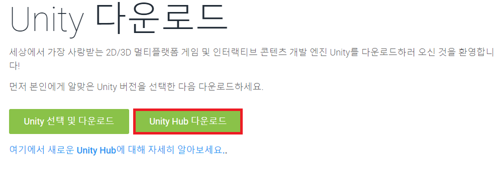
Unity Hub 다운로드 다 클릭
(**Unity Hub** 는 여러 버전의 **Unity**를 보다 편하게 사용할 수 있도록 도와주는 **관리 툴**입니다.)

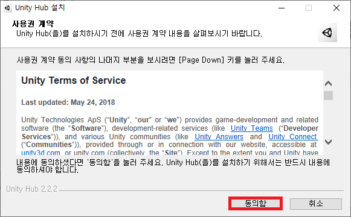
동의 클릭

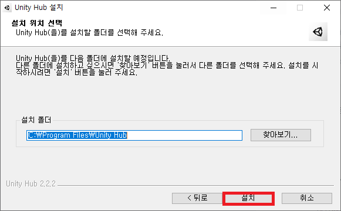
설치 클릭

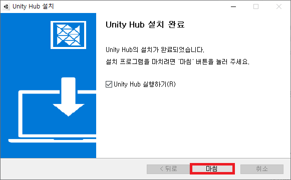
체크를 한후 마침을 눌러 Unity Hub 실행

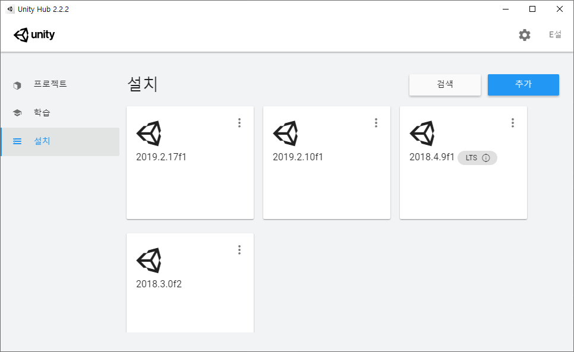
왼쪽의 설치 탭을 눌러 이동한 뒤 오른쪽 상단의 추가를 눌러줍니다.

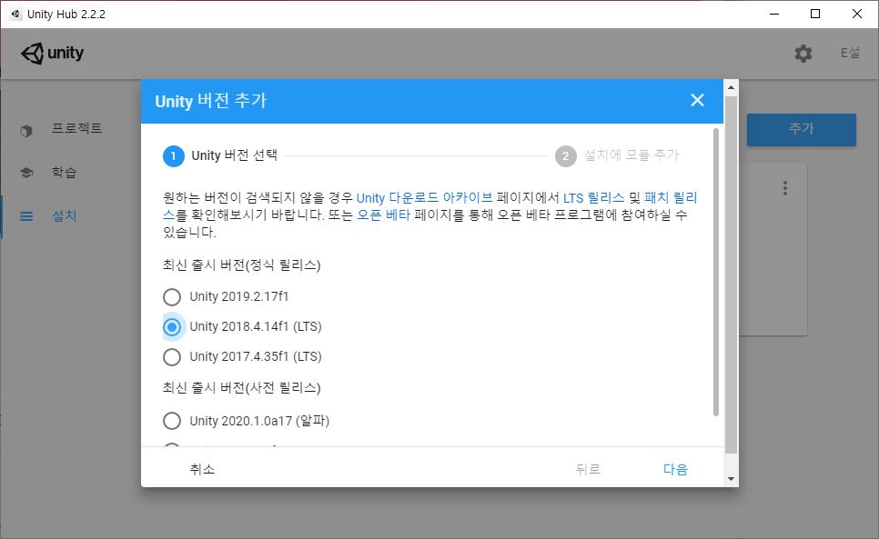
Unity 2018.4.14f1 (LTS)를 체크한 후 다음을 눌러 진행합니다.

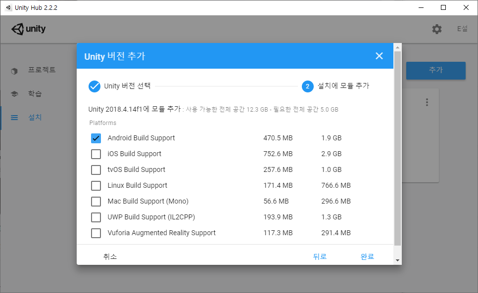
Android Build Support를 체크한 후 완료를 눌러 설치를 진행합니다.

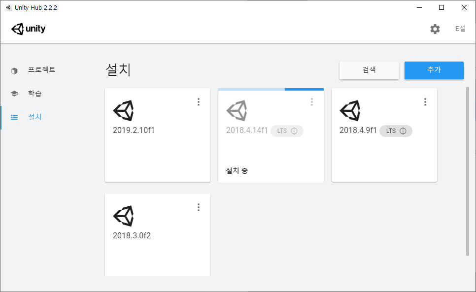
설치가 완료 될 때까지 기다려줍니다...

### 2. 프로젝트 생성

프로젝트 생성 탭으로 이동해줍니다.


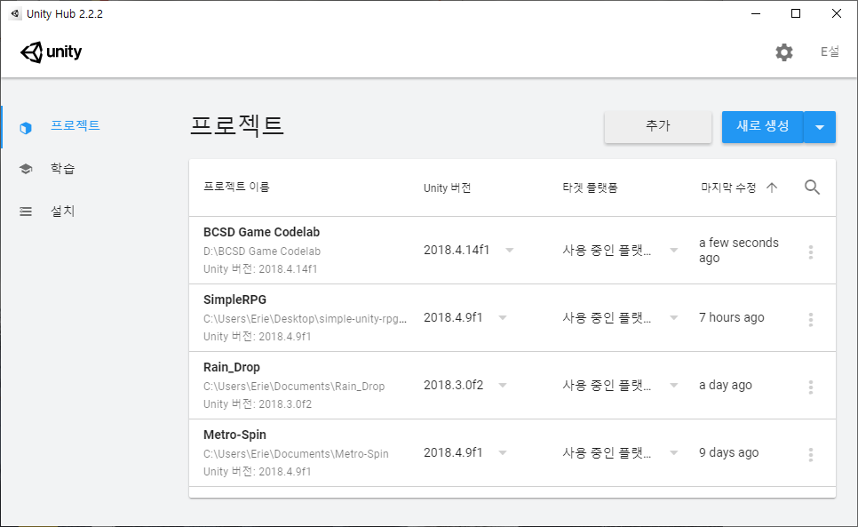
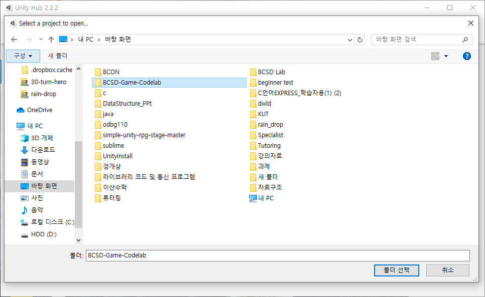
추가를 누른 뒤 Clone한 폴더를 선택해 줍니다.

자 그럼 이제 본격적으로 프로젝트를 진행해보겠습니다!

## 프로젝트 개발

### 0. 유니티 엔진


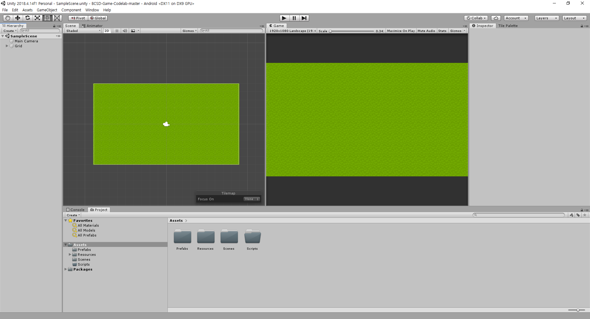
왼쪽에 hierarchy라고 써있는 창은 게임을 구성하는 요소들이 나타나는 창입니다. 저희가 화면에 무엇인가를 보이고 싶다고 할 때 이곳에 만들어서 보이게 할 수 있습니다.

하단의 Project는 단순한 Explorer입니다. 이곳에서 저희가 만든 Script나 Image등을 가져와서 Hierachy에 드래그해서 사용할 수 있습니다.

오른쪽의 Inspector창은 저희가 마우스로 클릭한 것의 상세한 정보를 알려주는 창입니다. 이곳에 나오는 정보를 수정하여서 저희가 원하는 기능을 구현할 수 있습니다.

가운데의 창에는 **Scene**과 **Game**이 있습니다.
여기서 **Scene**은 저희가 조작할 화면입니다. 캐릭터를 놓고 배경화면을 놓는 등의 보여지는 작업을 진행할 화면입니다.
**Game**은 게임을 실행했을 때의 모습을 보여주는 화면입니다. 가운데 상단을 보면 오른쪽 삼각형 버튼이 있는데 이 버튼을 누르면 Game화면에서 저희가 만든 게임을 테스트 해볼 수 있습니다

### 1. 플레이어 생성 및 움직이기
처음으로 플레이어를 생성해서 움직여 보도록하죠.

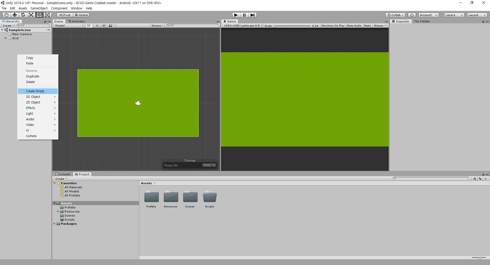
왼쪽 hierarchy창에 우클릭을 한 뒤 Create Empty 를 클릭하여 오브젝트를 생성해줍니다.
(**오브젝트**는 여러 기능들을 모아서 가질 수 있는 객체입니다.)

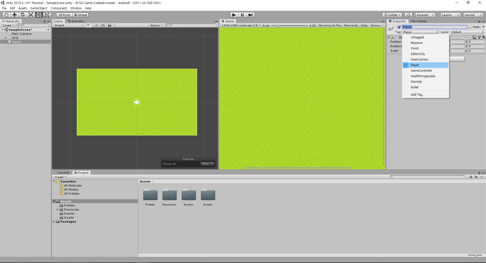
오른쪽 Inspector창의 상단에 있는 이름을 Player로 바꾸고 그 밑에 있는 Tag도 Player로 바꿔줍니다.
(**Tag**는 해당 **오브젝트가 무엇인지 확인**  또는 해당 **오브젝트를 찾기** 위한 용도로 쓰입니다.)

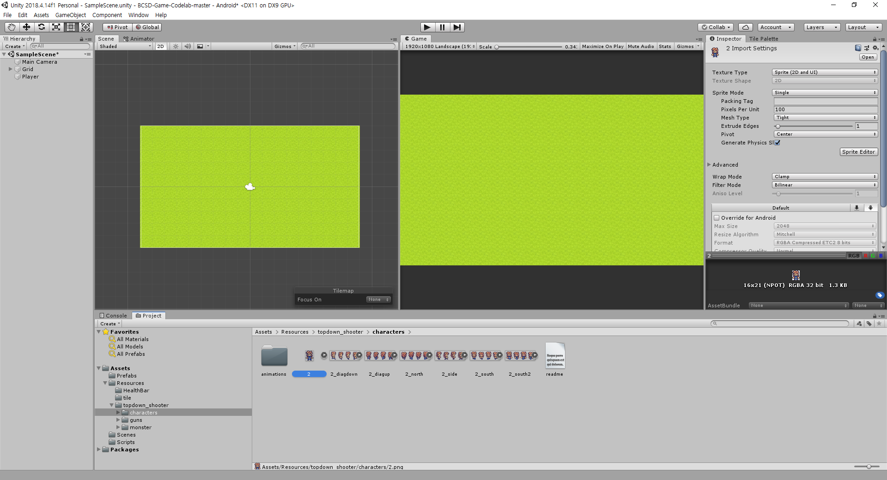

그 후 Resources폴더에 topdown_shooter/charater에 있는 2를 드래그 앤 드롭으로 Player에게 넣어줍니다.

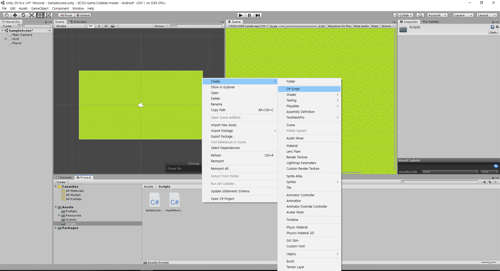
다음은 하단의 Project창으로 넘어가 보겠습니다.
Projcet창에 Scripts 폴더로 이동합니다.
(따로 폴더를 만드셔도 됩니다.)

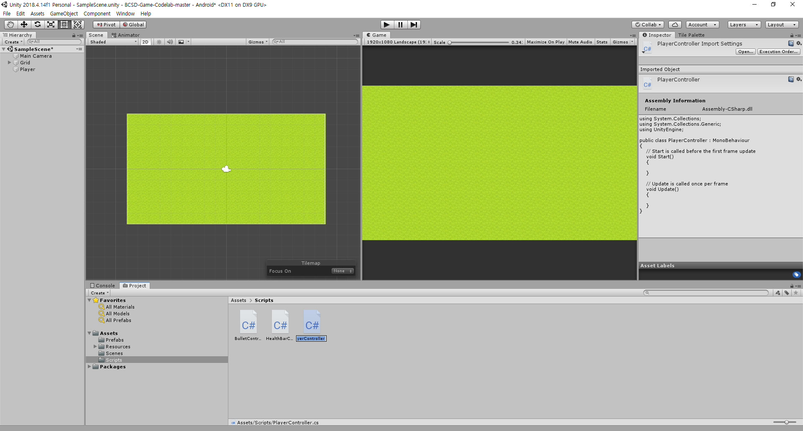
우클릭을 한뒤 Script생성을 눌러 PlayerController.cs 라는 파일을 만듭니다.


파일을 열어서 아래의 Code들을 넣어줍니다.
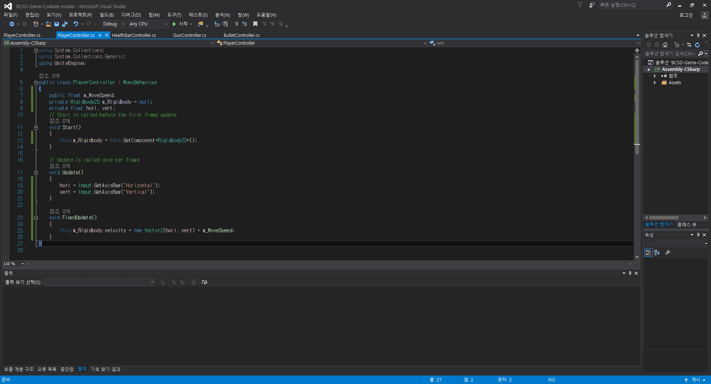
``` 
public class PlayerController : MonoBehaviour
{
    public float m_MoveSpeed;
    private Rigidbody2D m_Rigidbody = null;
    private float hori, vert;
    // Start is called before the first frame update
    void Start()
    {
        this.m_Rigidbody = this.GetComponent<Rigidbody2D>();
    }

    // Update is called once per frame
    void Update()
    {
        hori = Input.GetAxisRaw("Horizontal");
        vert = Input.GetAxisRaw("Vertical");
    }

    void FixedUpdate()
    {
        this.m_Rigidbody.velocity = new Vector2(hori, vert) * m_MoveSpeed;
    }
}
```
다시 아까 만든 Player GameObject로 가서 방금 작업한 Script를 드래그 앤 드롭을 통해 넣어줍니다.

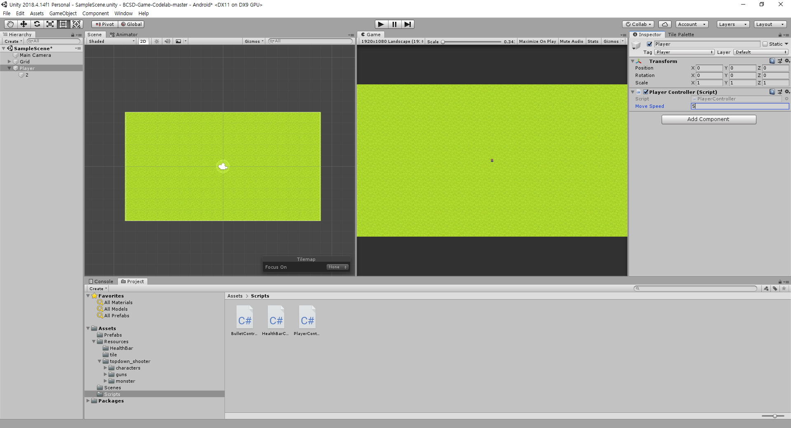
Inspector창에 보면 Script가 보일텐데 이곳에 나오는 Move Speed에 원하는 Speed를 넣어줍니다.

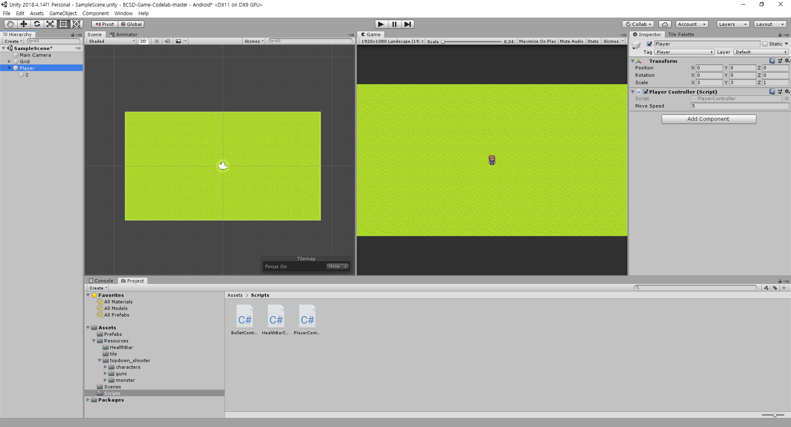
플레이어가 너무 작으니까 Scale을 바꿔 주죠. (Inspector창에 Transform에 있습니다.)

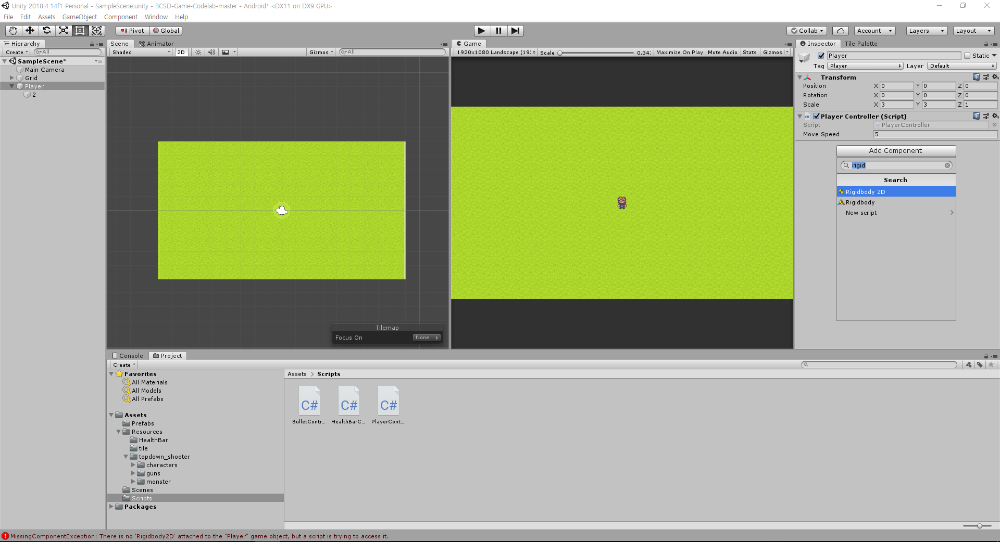
다음으로는 Add Component를 눌러서 RigidBody2D를 넣어줍니다.

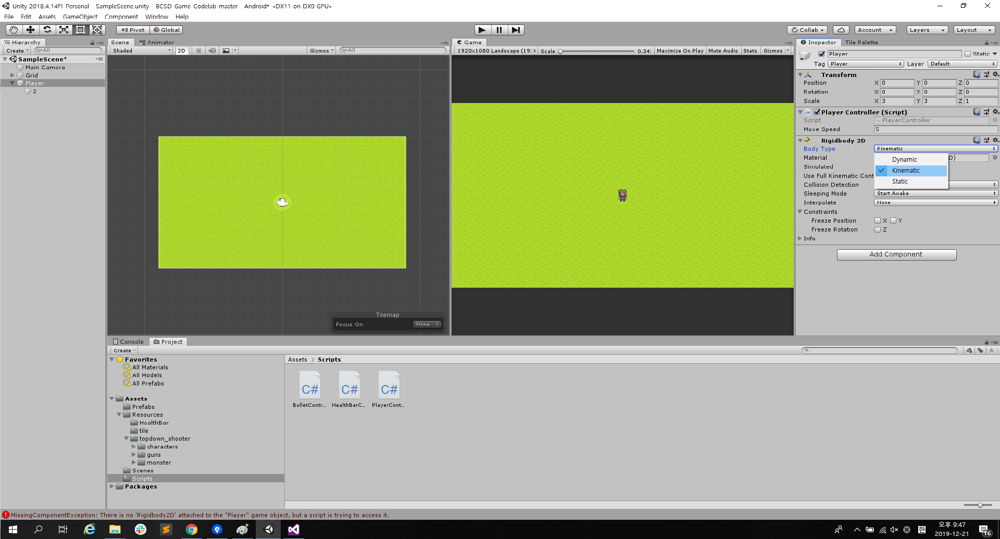
그리고 Body Type을 Kinematic으로 바꿔줍니다.

그럼 플레이 버튼을 누른 후 방향키를 통해 움직여 봅시다.
(플레이 버튼은 상단 중앙에 있습니다. [오른쪽 삼각형])

### 2. 플레이어 애니메이션 넣기
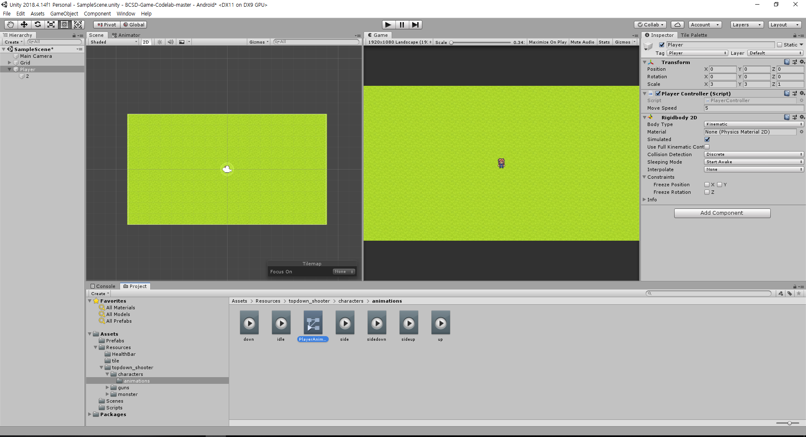
Project창에 아까 character로 가서 animations 폴더에 있는 PlayerAnimation을 아까 넣은 이미지에 드래그 앤 드롭을 통해 추가해 줍니다.

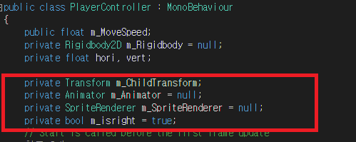
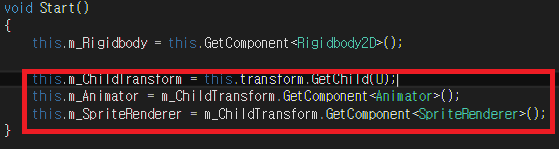
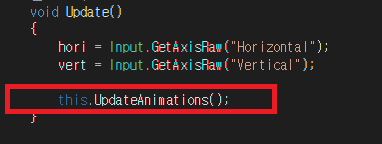
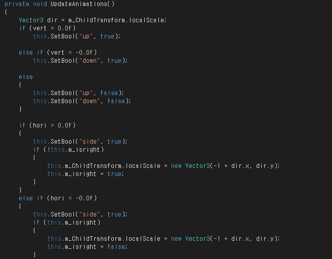
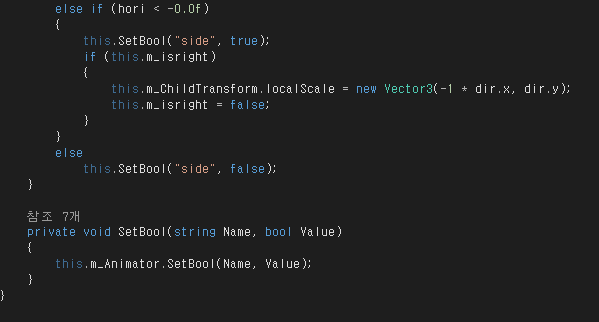
PlayerController.cs를 다음과 같이 변경해 줍니다.
```
public class PlayerController : MonoBehaviour
{
    public float m_MoveSpeed;
    private Rigidbody2D m_Rigidbody = null;
    private float hori, vert;

    private Transform m_ChildTransform;
    private Animator m_Animator = null;
    private SpriteRenderer m_SpriteRenderer = null;
    private bool m_isright = true;
    // Start is called before the first frame update
    void Start()
    {
        this.m_Rigidbody = this.GetComponent<Rigidbody2D>();

        this.m_ChildTransform = this.transform.GetChild(0);
        this.m_Animator = m_ChildTransform.GetComponent<Animator>();
        this.m_SpriteRenderer = m_ChildTransform.GetComponent<SpriteRenderer>();
    }

    // Update is called once per frame
    void Update()
    {
        hori = Input.GetAxisRaw("Horizontal");
        vert = Input.GetAxisRaw("Vertical");

        this.UpdateAnimations();
    }

    void FixedUpdate()
    {
        this.m_Rigidbody.velocity = new Vector2(hori, vert) * m_MoveSpeed;
    }

    private void UpdateAnimations()
    {
        Vector3 dir = m_ChildTransform.localScale;
        if (vert > 0.0f)
            this.SetBool("up", true);

        else if (vert < -0.0f)
            this.SetBool("down", true);

        else
        {
            this.SetBool("up", false);
            this.SetBool("down", false);
        }

        if (hori > 0.0f)
        {
            this.SetBool("side", true);
            if (!this.m_isright)
            {
                this.m_ChildTransform.localScale = new Vector3(-1 * dir.x, dir.y);
                this.m_isright = true;
            }
        }
        else if (hori < -0.0f)
        {
            this.SetBool("side", true);
            if (this.m_isright)
            {
                this.m_ChildTransform.localScale = new Vector3(-1 * dir.x, dir.y);
                this.m_isright = false;
            }
        }
        else
            this.SetBool("side", false);
    }

    private void SetBool(string Name, bool Value)
    {
        this.m_Animator.SetBool(Name, Value);
    }
}

```

### 3. 몬스터 생성 및 움직이기
이번에는 플레이어를 따라다니는 몬스터를 추가해 보겠습니다.

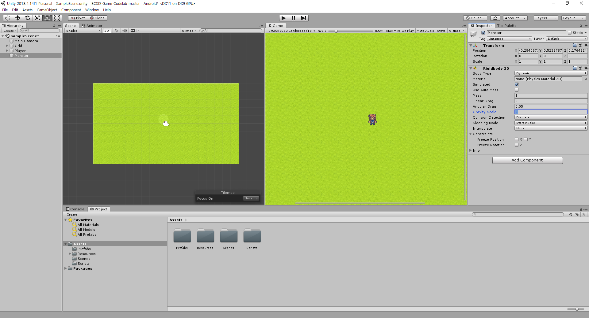
먼저 Create Empty를 한 후 이름과 tag를 Monster로 바꿔줍니다.
RigidBody2D를 추가하고 Gravity Scale을 0으로 설정해줍니다.
(Body Type은 Dynamic)
(자세한 설명은 1에 있습니다.)


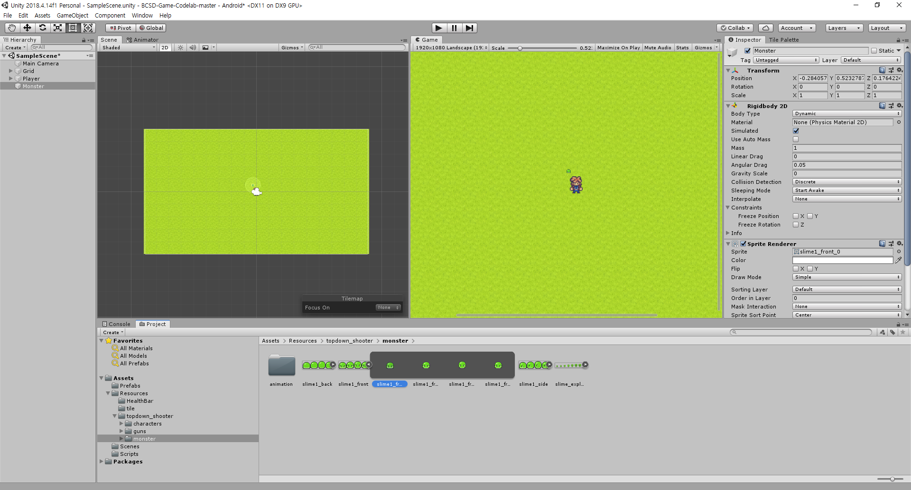
add Component로 Sprite Renderer를
추가한다음 Monster폴더에 있는 Slime이미지를  Sprite에 드래그 앤 드롭으로 추가해 줍니다.
(잘 보이도록 Scale을 조정해 줍니다.)

MonsterController.cs 스크립트를 만든 후
다음의 Code들을 작성해 줍니다.
Monster GameObject에 Script를 추가한 후 Play버튼을 통해 확인해 봅니다.
```

public class MonsterController : MonoBehaviour
{
    GameObject target;
    Rigidbody2D m_RigidBody2D;
    public float m_MoveSpeed = 3.0f;
    private Vector3 dir;
    // Start is called before the first frame update
    void Start()
    {
        this.target = GameObject.FindGameObjectWithTag("Player");
        this.m_RigidBody2D = GetComponent<Rigidbody2D>();
    }

    // Update is called once per frame
    void Update()
    {

        if (target.transform != null)
        {
            dir = target.transform.position - this.transform.position;
            this.m_RigidBody2D.MovePosition(this.transform.position + Vector3.Normalize(dir) * this.m_MoveSpeed * Time.deltaTime);
            
        }
    }
}

```

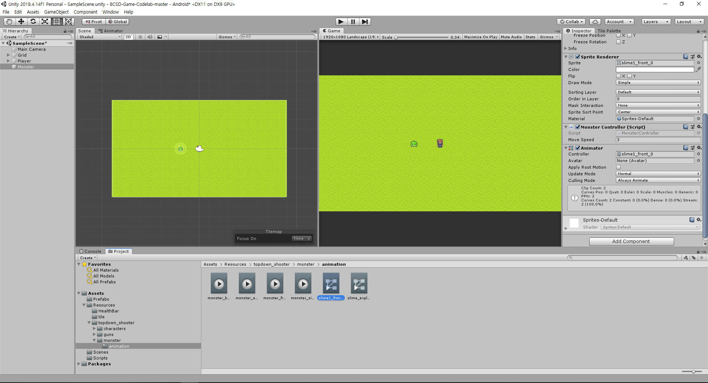
잘 움직인다면 다음은 Monster에게 Animation을 넣어주겠습니다.
Project 창에서 MonsterAnimation(slime1_front)을 찾아서 Monster에게 드래그 앤 드롭을 통해 추가해 줍니다.

다음의 Code들을 추가해 주고
(Update는 변경입니다.)
```
	void Update()
    {
        if (target.transform != null)
        {
            dir = target.transform.position - this.transform.position;
            this.m_RigidBody2D.MovePosition(this.transform.position + Vector3.Normalize(dir) * this.m_MoveSpeed * Time.deltaTime);

            if (dir.y > 0.0f)
            {
                this.SetBool("back", true);
            }
            else
            {
                this.SetBool("back", false);
            }
        }
    }
    
    private void SetBool(string Name, bool Value)
    {
        this.GetComponent<Animator>().SetBool(Name, Value);
    }

```
다시 Play 버튼으로 확인해 봅니다.

### 5. 플레이어를 따라다니는 카메라 만들기
이번에는 플레이어가 움직이는 것에 따라서 같이 움직이는 카메라를 만들어 보겠습니다.

Project창에 우클릭으로 Script를 만들어 줍니다.
이름은 CameraController.cs로 하겠습니다.

다음의 Code들을 넣어 준 다음에
```
public class CameraController : MonoBehaviour
{
    public float follow_speed = 4.0f;
    public float z = -20.0f;
    public GameObject Target;

    Transform this_transform;
    Transform Target_transform;

    void Start()
    {
        Target = GameObject.FindGameObjectWithTag("Player");
        this_transform = GetComponent<Transform>();
        Target_transform = Target.GetComponent<Transform>();
    }
    void Update()
    {
        this_transform.position = Vector2.Lerp(this_transform.position, Target_transform.position, follow_speed * Time.deltaTime);
        this_transform.Translate(0, 0, z);
    }
}

```

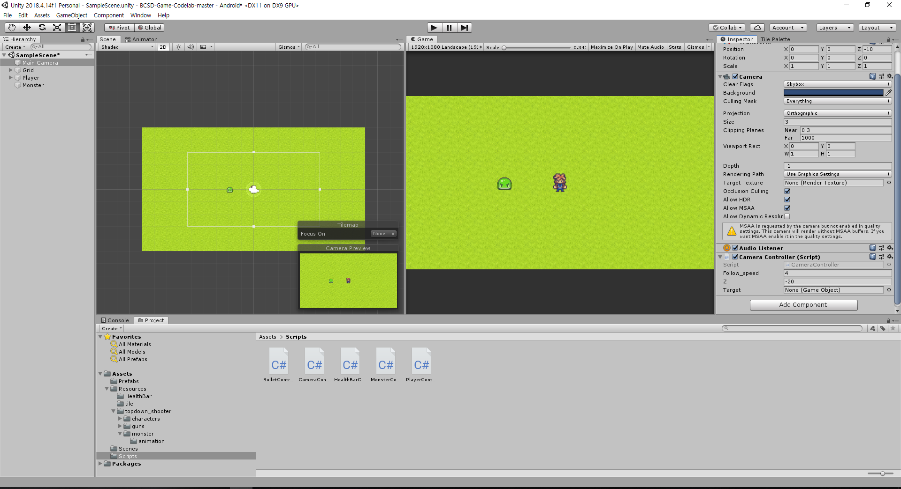
왼쪽의 Hierachy 창에 MainCamera에 Script를 넣어줍니다.
추가적으로 Size를 줄여(2~3정도) 화면을 확대해 줍니다.

이번에도 Play버튼으로 확인해 봅니다.

### 6. HP바 만들기
이번에는 플레이어와 몬스터에게 HP를 만들어 주고 그것을 보여줄 HP바를 만들어 보겠습니다.
추가로 플레이어와 몬스터가 부딪히면 서로가 HP가 달도록 해보겠습니다.

우선 HP를 만들어 주기위해서 PlayerController와 MonsterController에 class 선언 아래에 Code를 추가해 줍니다.
```
    private float m_MaxHealth = 5.0f;//여기는 마음대로 정해주세요(플레이어는 높은게 좋겠죠?)
```

다음 HealthBarController.cs Script를 열어서 다음의 Code들을 넣어줍니다.
```

public class HealthBarController : MonoBehaviour
{
    private Transform target = null;
    private float m_health;
    private float m_max_health;
    private bool is_init = false;
    private Transform bar = null;
    // Start is called before the first frame update
    void Start()
    {
        bar = this.transform.GetChild(0);
        m_health = m_max_health;
        target = this.transform.parent;
    }

    // Update is called once per frame
    void Update()
    {
        bar.localScale = new Vector3(m_health / m_max_health, 1);
        this.transform.position = new Vector3(target.position.x, target.position.y + 0.5f);

    }
    public void Damaged(float damage)
    {
        m_health -= damage;
    }
    public float getCurrentHealth()
    {
        return m_health;
    }
    public void setMaxHealth(float targetMaxHealth)
    {
        m_max_health = targetMaxHealth;
        if (!is_init)
            m_health = m_max_health;
    }
}

```
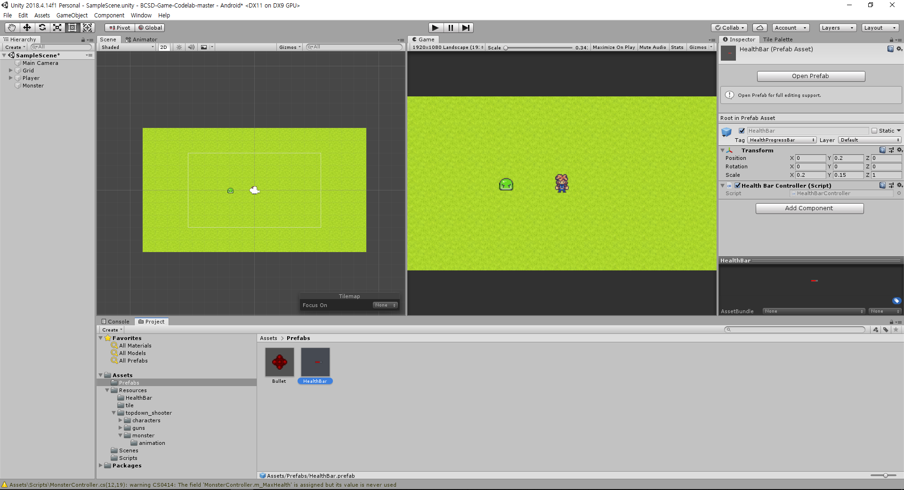
다음 Prefabs폴더에 있는 HealthBar를 Hierachy에 Player나 Monster에게 드래그 앤 드롭으로 아래 들어가도록 넣어줍니다.
(HealthBar를 두개 가져와서 각각 넣어주면 됩니다. + 바로 넣어주세요.)

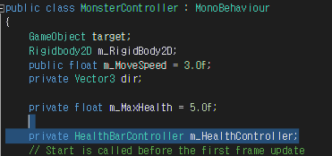


다음으로 MonsterController와 PlayerController Class 선언 밑에
```
    private HealthBarController m_HealthController;
```
MonsterController는 Start()에 
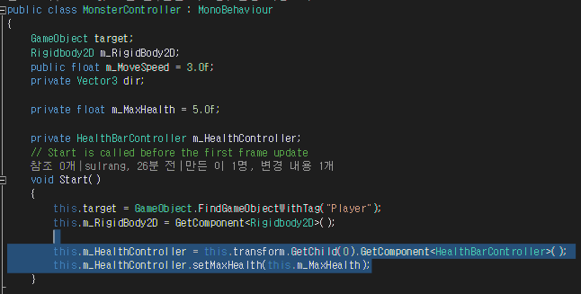
```
        this.m_HealthController = this.transform.GetChild(0).GetComponent<HealthBarController>();
        this.m_HealthController.setMaxHealth(this.m_MaxHealth);
```
PlayerController는 Start()에 
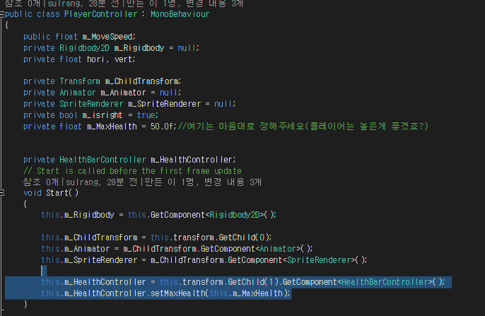
```
        this.m_HealthController = this.transform.GetChild(1).GetComponent<HealthBarController>();
        this.m_HealthController.setMaxHealth(this.m_MaxHealth);
```
를 넣어줍니다. (Start함수에 넣는 코드의 차이는 GetChile(숫자) 뿐입니다.


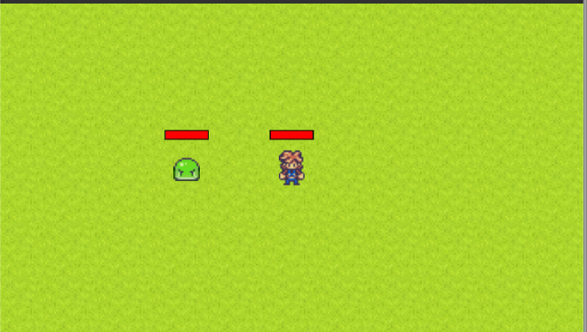
이번에도 역시 Play버튼으로 확인해 봅니다.

### 7. 몬스터 랜덤 스폰 시키기
몬스터를 맵의 랜덤 위치에서 생성시켜 보겠습니다.

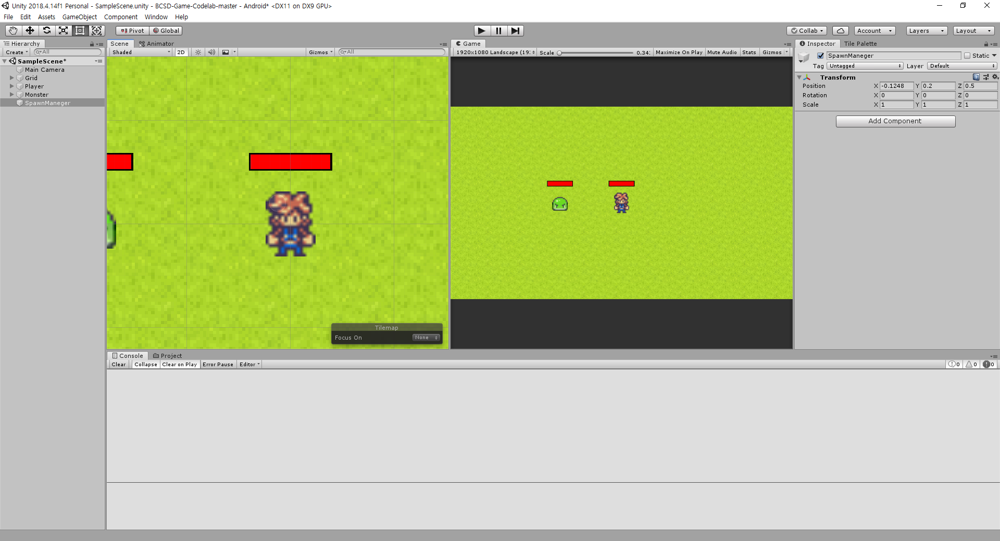
우선 GameObject를 하나 만듭니다.(저는 SpawnManager라고 만들었습니다.)

SpawnController.cs Script를 만들고 다음 Code 를 넣어줍니다.

```
public class SpawnController : MonoBehaviour
{
    // Start is called before the first frame update
    private int m_MonsterCount = 0;
    private float m_SpawnVertical, m_SpawnHorizontal;
    private float m_Distance = 5.0f;
    public GameObject m_MonsterObject = null;
    public int m_MaxMonsterCount = 1;

    // Update is called once per frame
    void Update()
    {
        this.m_SpawnHorizontal = Random.Range(-m_Distance, m_Distance);
        this.m_SpawnVertical = Mathf.Sqrt(Mathf.Pow(this.m_Distance, 2.0f) - Mathf.Pow(this.m_SpawnHorizontal, 2.0f));
        this.m_MonsterCount = this.transform.childCount;
        if (m_MonsterCount < m_MaxMonsterCount)
        {
            GameObject.Instantiate(m_MonsterObject, new Vector3(this.m_SpawnHorizontal, this.m_SpawnVertical, -1.0f), new Quaternion(0, 0, 0, 0)).transform.parent = this.transform;
        }
    }
}
```

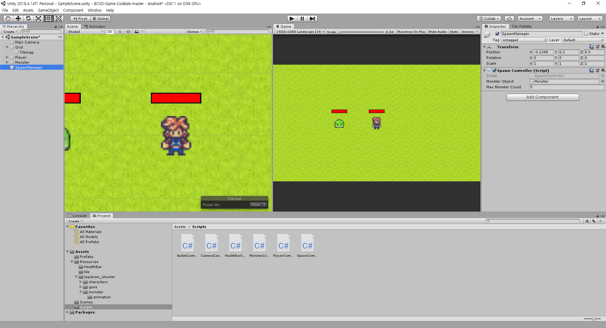
SpawnManger GameObject에 드래그 앤 드롭으로 넣어 주고
Monster Object부분에 Monster GameObject를 넣어줍니다.
그리고 원하는 만큼 MonsterMaxCount를 넣어줍니다.

### 8. 타격, 피격 구현하기
지금까지 잘 따라와 주셔서 감사합니다!
마지막으로 타격과 피격을 구현해보도록 하겠습니다.
우선 Player와 Monster에게 add Component를 통해 BoxCollider2D를 넣어줍니다.
그 다음 Edit Collider를 눌러 캐릭터 크기에 맞게 Collider크기를 조절해 줍니다.
다음으로 RigidBody2D의 Constraints를 눌러서 Freeze Rotation Z를 체크해줍니다.

다음 MonsterController에 아래의 Code들을 추가해줍니다.
```
    private void OnCollisionEnter2D(Collision2D Collider)
    {
        if (Collider.transform.tag == "Player" || Collider.transform.tag == "Bullet")
        {
            this.m_HealthController.Damaged(1.0f);

            if (this.m_HealthController.getCurrentHealth() <= 0)
            {
                this.Dead();
            }
            this.KnockBack(Collider);
        }
    }
    void Dead()
    {
        Destroy(this.gameObject);
    }
    void KnockBack(Collision2D target)
    {
        this.transform.position -= (target.transform.position - this.transform.position) * 30 * Time.deltaTime;
    }
```
그리고 PlayerController.cs 는

```
public class PlayerController : MonoBehaviour
{
    public float m_MoveSpeed;

    private float hori, vert, m_MaxHealth = 100.0f;
    private Rigidbody2D m_Rigidbody = null;
    private Animator m_Animator = null;
    private SpriteRenderer m_SpriteRenderer = null;
    private bool m_isright = true;
    private Vector2 m_ForceUpdate = Vector2.zero;
    private HealthBarController m_HealthController;
    private Transform m_ChildTransform;
    private GunController m_GunController;
    void Start()
    {
        this.m_Rigidbody = this.GetComponent<Rigidbody2D>();
        this.m_HealthController = this.transform.GetChild(1).GetComponent<HealthBarController>();
        this.m_ChildTransform = this.transform.GetChild(0);
        this.m_Animator = m_ChildTransform.GetComponent<Animator>();
        this.m_SpriteRenderer = m_ChildTransform.GetComponent<SpriteRenderer>();
        this.m_HealthController.setMaxHealth(m_MaxHealth);
        this.m_GunController = this.transform.GetChild(2).GetComponent<GunController>();
    }

    void Update()
    {
        hori = Input.GetAxisRaw("Horizontal");
        vert = Input.GetAxisRaw("Vertical");
        this.UpdateAnimations();
        if (Input.GetKeyDown("space"))
            this.m_GunController.shoot();
    }

    void FixedUpdate()
    {
        this.m_Rigidbody.velocity = new Vector2(hori, vert) * m_MoveSpeed;
    }
    private void UpdateAnimations()
    {
        Vector3 dir = m_ChildTransform.localScale;
        if (vert > 0.0f)
            this.SetBool("up", true);

        else if (vert < -0.0f)
            this.SetBool("down", true);

        else
        {
            this.SetBool("up", false);
            this.SetBool("down", false);
        }

        if (hori > 0.0f)
        {
            this.SetBool("side", true);
            if (!this.m_isright)
            {
                this.m_ChildTransform.localScale = new Vector3(-1 * dir.x, dir.y);
                this.m_isright = true;
            }
        }
        else if (hori < -0.0f)
        {
            this.SetBool("side", true);
            if (this.m_isright)
            {
                this.m_ChildTransform.localScale = new Vector3(-1 * dir.x, dir.y);
                this.m_isright = false;
            }
        }
        else
            this.SetBool("side", false);
    }

    private void SetBool(string Name, bool Value)
    {
        this.m_Animator.SetBool(Name, Value);
    }

    private void OnCollisionEnter2D(Collision2D Collider)
    {
        if (Collider.transform.tag == "Monster")
        {
            this.m_HealthController.Damaged(1.0f);
            if (this.m_HealthController.getCurrentHealth() <= 0)
                this.Dead();
        }
    }

    private void Dead()
    {
        Destroy(this.gameObject);
    }

    public int getDir()
    {
        if (this.m_Animator.GetBool("up"))
        {
            if (this.m_Animator.GetBool("side"))
                return 1;
            else
                return 4;
        }
        else if (this.m_Animator.GetBool("down"))
        {
            if (this.m_Animator.GetBool("side"))
                return 0;
            else
                return 2;
        }
        else
            return 3;
    }
    public Vector3 getDirection()
    {
        return new Vector3(hori, vert, 0);
    }
}
```
이렇게 수정해 줍니다. (그대로 복사 붙여넣기를 하셔도 됩니다.

그리고
GameObject를 만들어서 Gun이라는 이름으로 만들어준 후
GunController.cs를 만들어 다음의 Script를 넣어줍니다.
```

public class GunController : MonoBehaviour
{
    public Sprite[] Gun;
    private PlayerController m_PlayerController;
    private SpriteRenderer m_SpriteRenderer;
    public GameObject Bullet;
    // Start is called before the first frame update
    void Start()
    {
        this.m_PlayerController = this.transform.parent.GetComponent<PlayerController>();
        this.m_SpriteRenderer = this.gameObject.GetComponent<SpriteRenderer>();
    }

    // Update is called once per frame
    void Update()
    {
        int dir = this.m_PlayerController.getDir();
        this.m_SpriteRenderer.sprite = this.Gun[dir];

    }

    public void shoot()
    {
        Instantiate(Bullet, this.transform.parent.position, new Quaternion(0, 0, 0, 0));
    }
}
```
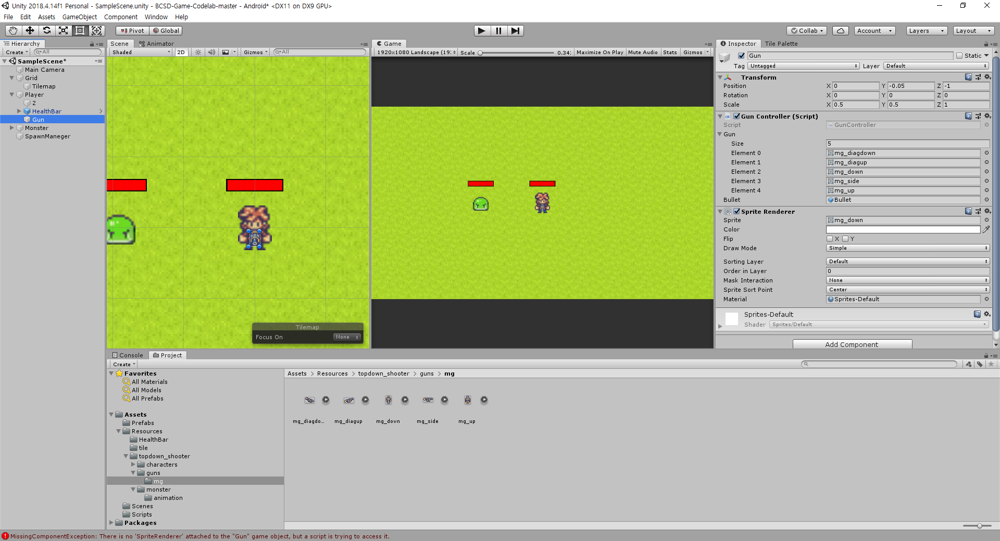
Gun Object에 Script와 Sprite Renderer를 넣고 다음과 같이 설정해줍니다.
bullet은 prefabs폴더에 있고,
각 이미지들은 topdown_shooter/guns/mg에 있습니다.
다음으로 BulletController.cs를 열어서 다음의 Script를 넣어줍니다.
```

public class BulletController : MonoBehaviour
{
    private float m_livetime;
    private Vector2 dir;
    public float m_BulletSpeed = 1.0f;
    private PlayerController m_PlayerController;
    // Start is called before the first frame update
    void Start()
    {
        m_PlayerController = GameObject.FindGameObjectWithTag("Player").GetComponent<PlayerController>();
        m_livetime = 0.0f;
        dir = m_PlayerController.getDirection();
    }

    // Update is called once per frame
    void Update()
    {
        transform.Translate(dir * m_BulletSpeed * Time.deltaTime);
        m_livetime += Time.deltaTime;
        if (m_livetime > 5.0f ||dir == new Vector2(0, 0))
            Destroy(this.gameObject);
    }

    private void OnCollisionEnter2D(Collision2D Collider)
    {
        if (Collider.transform.tag == "Monster")
            Destroy(this.gameObject);
    }
}
```


Gun Object를 Player에 넣어주고 가장 아래 위치하도록
Inspector창의 Position을 캐릭터가 들고 있는 것처럼 잘 맞춰주시면 됩니다!


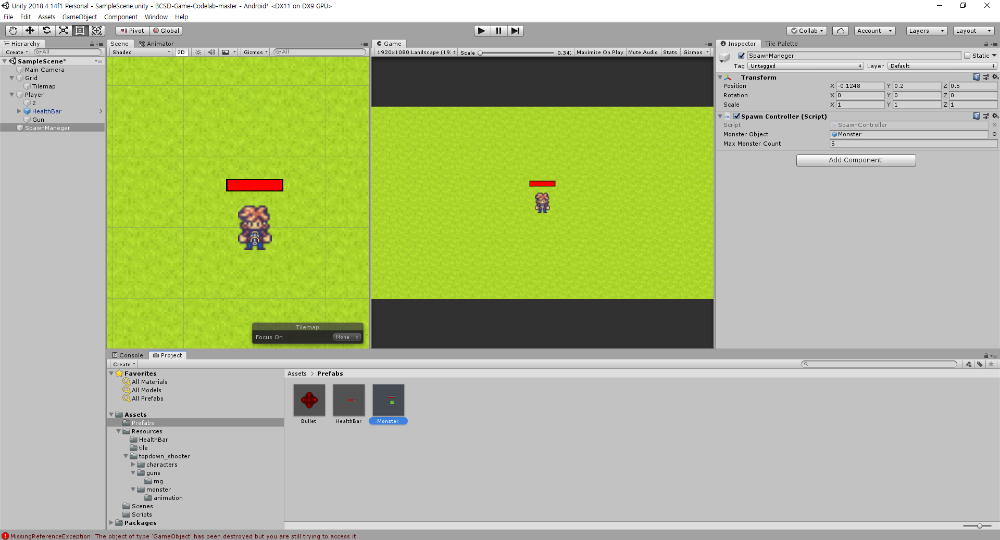
마지막으로 Monster오브젝트를 Prefabs폴더로 드래그 해준 뒤 hieracht에서 없애고 SpawnManager의 Script에 Prefabs폴더의 Monster를 넣어주시면 됩니다!


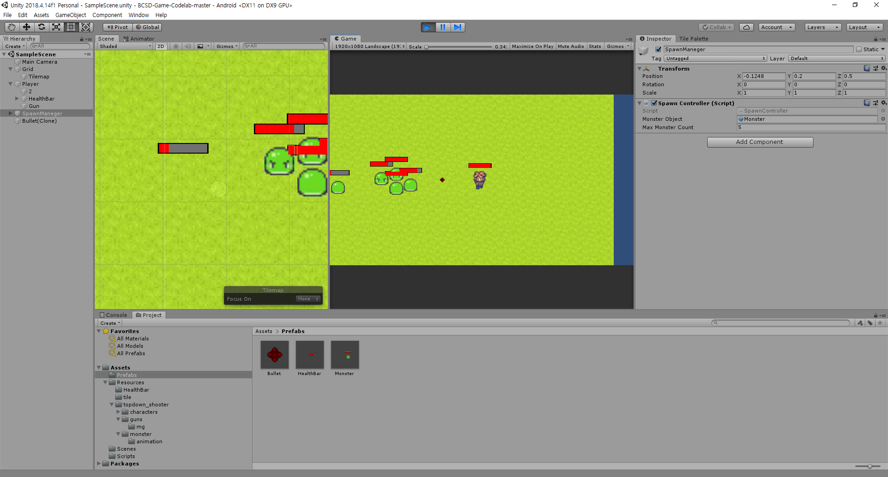
그러면 완성입니다!

방향키와 Space로 게임을 즐겨보세요!